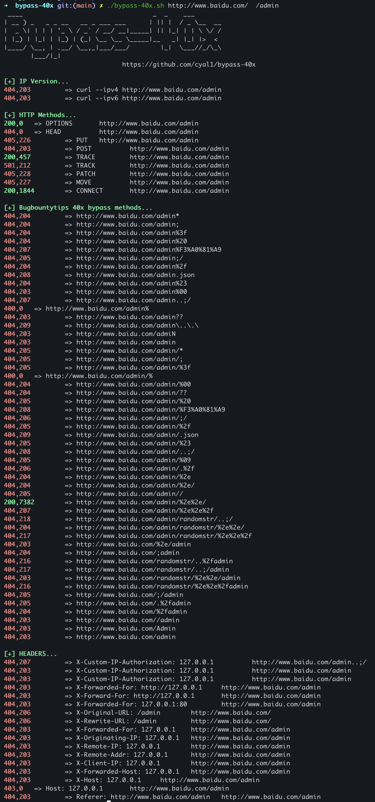

# bypass-40x

bypass 401/403 

```
 ____                                  _  _    ___
| __ ) _   _ _ __   __ _ ___ ___      | || |  / _ \__  __
|  _ \| | | | '_ \ / _` / __/ __|_____| || |_| | | \ \/ /
| |_) | |_| | |_) | (_| \__ \__ \_____|__   _| |_| |>  <
|____/ \__, | .__/ \__,_|___/___/        |_|  \___//_/\_\
       |___/|_|
                               https://github.com/cyal1/bypass-40x
./bypass-40x.sh  [OPTIONS]  https://example.com /dir
./bypass-40x.sh  [OPTIONS]  https://example.com/dir1/dir2 /dir3/dir4

OPTIONS:
	-r Allow redirection if response is 3XX

```



## Reference

https://github.com/iamj0ker/bypass-403

https://github.com/lobuhi/byp4xx